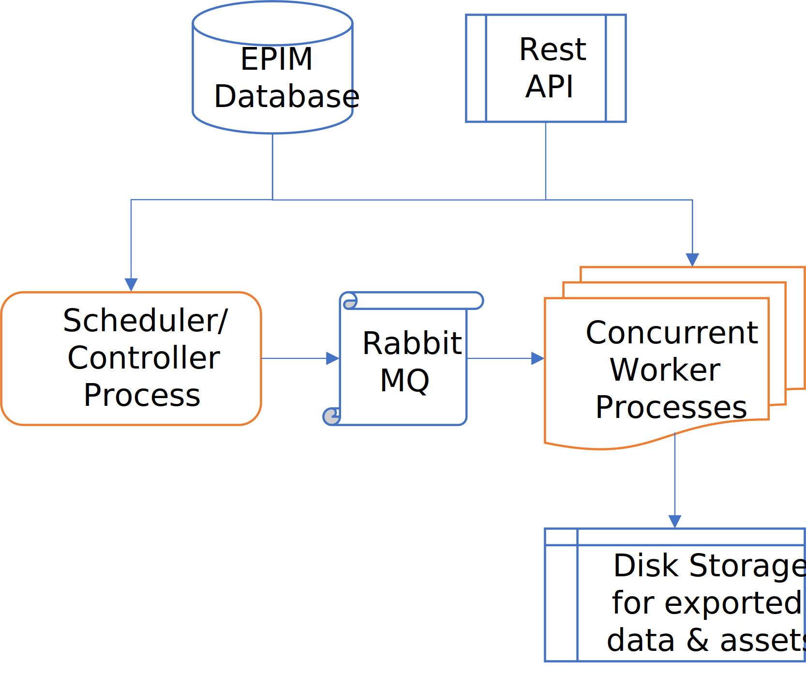

# Architecture

The Optimized Exports application consists of two components:
1. a job Controller that watches for new exports to be executed that are either scheduled or requested to be run on demand, and
2. several Worker processes that pick up jobs assigned by the Controller to extract data, as specified by the Export Configuration and custom mappings designed by users.

Two JARs are compiled for the two components. It is important to note that the Controller has to be started first. The startup activity includes an initial setup process, which includes a cleanup activity of any temporary files and tables left over from the previous execution. Once this is complete, any number of workers may be started to pickup and execute export jobs. These processes may be started on the same or different VMs, depending on the availability of resources (CPU, RAM, etc).

## Dependencies

This application is designed to be an addon to the EnterWorks application. As such, it relies of several core capabilities and expects the following components to be up and running during its operation:
 - Sql Server Database: Several new stored procedures and functions have been created for specific purposes, which are described in a dedicated section.
 - Rabbit MQ: The Controller first connects to it and creates a queue (if one does not already exists). Then, the Workers will connect to the queue to pick up export jobs.
 - Rest API on the Tomcat server: Schedule and Log updates, Saved Search, and a few other actions use the Rest API.
 - A large shared drive to store all the exported files and assets.

## Batched processing

For performance and resource considerations, large exports are split into batches of _x_ records per batch. The value for _x_ is set in the properties file.

## Core vs customized code

The export worker application is developed as a series of core _processors_ that are each capable of performing a specific task. These processors are weaved together using various options/parameters to extract data from multiple repositories, combine or merge data, apply transformations (such as pivoting data, concatenating value and uom, etc) in a series of AD-specific export worker classes. This design pattern allows us to create additional export types by using existing tested classes, thus providing code re-use and minimizing bugs.

See the separate sections for detailed descriptions of the core processors and the AD-specific customized export worker classes.

## Java architecture

This is a spring-boot application. The application consists of three maven projects.

 - **exports-core:** consists of the core classes that are common to and used by the controller and workers, including classes that represent the database objects, an API service and utility classes. This is applied as a dependency for the controller and worker projects, and is _not_ run as a separate process.

 - **exports-controller:** is used to determine the next job to executed by the export workers. At startup, it also performs some cleanup tasks such as deleting old temporary tables, and flagging incomplete exports from a previous run. It works with RabbitMQ to enqueue export jobs to be executed by the worker processes. One instance of the controller is started.

 - **exports-worker:** picks up jobs to be executed from RabbitMQ and generates the export defined in the Export Configuration. Depending on the type of the export and the volume of records, each export may take several hours to complete. A job-specific log file is generated for each export, which is shared with the end-user that they can view using the Log File GO button in the repository/UI. Multiple instances of the worker are started. As of this writing, the AD production environment runs 8 workers in 2 VMs (4 workers per VM).

The controller must be started before any of the workers are started. If it finds that any worker is subscribed to the RabbitMQ queue before the controller was started, it will abort with an error message.
